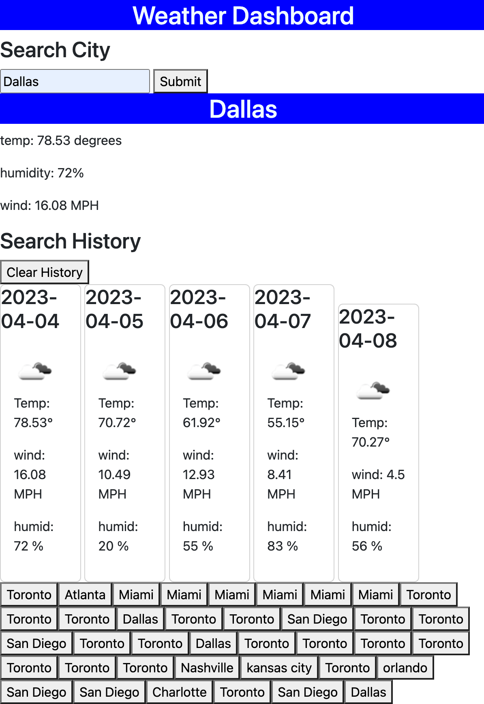

# Weather-Dashboard-06

## Description 
This project was created with the intent to display current weather data using weather apis. Working through this project i was able to gain a deeper knowledge and understanding of how server side APIs work and function. Although there are many updates that will be made to this projects I was able to produce and rather responsive and functional minimal valueable product (MVP) that works.

## Usage

The technologies used for this project was :
- HTML
- CSS
- Bootstrap
- JavaScript
- Openweatherapi.org 

## Contributors
- Sarah Miller

## License
MIT license

